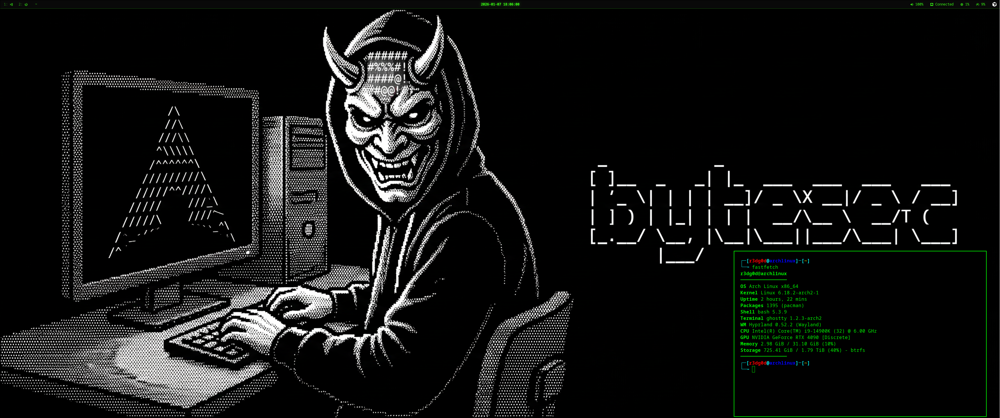

# My Dotfiles

A collection of my dotfiles for a riced Linux desktop environment using Hyprland, Dank Material Shell (DMS), and Fastfetch.

## Screenshot



## What's Included

- **Hyprland** - Window manager configuration
- **Dank Material Shell (DMS)** - Modern, Material-inspired shell/bar replacement with panels, widgets, and desktop integration
- **Fastfetch** - System information display with custom OS installation date and age modules
- **Ghostty** - Terminal emulator configuration
- **GTK 3.0/4.0** - Material-based themes and settings

## Installation

### Prerequisites

- Arch Linux
- Hyprland window manager
- Dank Material Shell
- Fastfetch
- Ghostty
- Required fonts: Nerd Fonts (for icons)

### Quick Install

1. Clone this repository:
```bash
git clone https://github.com/r3dg0d/dotfiles.git ~/dotfiles
cd ~/dotfiles
```

2. Run the install script:
```bash
chmod +x install.sh
./install.sh
```

3. Reload Hyprland:
```bash
hyprctl reload
```

### Manual Installation

If you prefer to install manually:

1. Backup your existing dotfiles:
```bash
mkdir -p ~/.config-backup
cp -r ~/.config/hypr ~/.config-backup/ 2>/dev/null
cp -r ~/.config/DankMaterialShell ~/.config-backup/ 2>/dev/null
cp -r ~/.config/fastfetch ~/.config-backup/ 2>/dev/null
```

2. Copy the dotfiles:
```bash
cp -r .config/hypr ~/.config/
cp -r .config/DankMaterialShell ~/.config/
cp -r .config/fastfetch ~/.config/
```

3. Reload Hyprland:
```bash
hyprctl reload
```

## Configuration Details

### Hyprland

- **Monitors**: Configured for dual monitor setup (DP-1 and HDMI-A-1)
- **Keybindings**: Custom keybindings for DMS integration (Spotlight, Clipboard, Process List, etc.)
- **Input**: Keyboard and mouse configuration with numlock enabled
- **Animations**: Custom animations for windows and workspaces

**Important**: Update monitor configuration in `hyprland.conf` to match your monitor setup!

### Dank Material Shell (DMS)

- **Panels**: Material You inspired panels with transparency and animations
- **Widgets**: System monitoring, workspace management, media controls, and notifications
- **IPC Support**: Integrated with Hyprland keybindings for seamless control
- **Settings**: Comprehensive JSON-based configuration

DMS replaces traditional status bars with a more modern, integrated approach. Configuration is managed in `~/.config/DankMaterialShell/`.

### Fastfetch

- **Custom Modules**: 
  - OS Installation Date (from pacman.log)
  - OS Age (calculated from installation date)
- **Display**: Shows system information with consistent styling and custom ASCII art

## Customization

### Monitor Configuration

Edit `~/.config/hypr/hyprland.conf` to match your setup. Look for monitor configuration lines:

```bash
monitor=DP-1, 3440x1440@180, 0x0, 1
monitor=HDMI-A-1, 3440x1440@180, 3440x0, 1
```

### DMS Configuration

DMS can be configured by editing the settings in `~/.config/DankMaterialShell/settings.json`.

## Migration Notes

This setup has migrated from Noctalia Shell to **Dank Material Shell**. It offers better integration with Hyprland and a more refined Material design aesthetic.

## License

This configuration is free to use and modify. Feel free to fork and adapt it to your needs!

## Credits

- Inspired by various ricing communities
- Dank Material Shell: [r3dg0d/DankMaterialShell](https://github.com/r3dg0d/DankMaterialShell)
- Fastfetch: [fastfetch-cli/fastfetch](https://github.com/fastfetch-cli/fastfetch)

## Contributing

Feel free to open issues or submit pull requests if you have improvements!

---

**Note**: Remember to update monitor configurations, keyboard layouts, and any personal paths/commands before using this setup.
