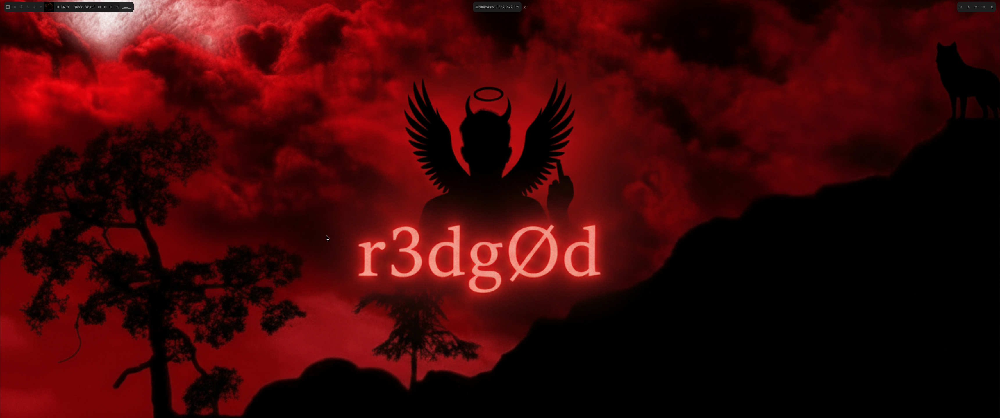

# My Dotfiles

A collection of my dotfiles for a riced Linux desktop environment using Hyprland, Waybar, Ghostty, and Fastfetch.

## What's Included

- **Hyprland** - Window manager configuration
- **Waybar** - Status bar with Spotify integration and cava visualizer
- **Ghostty** - Terminal configuration
- **Fastfetch** - System information display
- **EWW** - (Optional) Extended Widget Works configuration

## Screenshots



## Installation

### Prerequisites

- Arch Linux (or Arch-based distribution)
- Hyprland window manager
- Waybar
- Ghostty terminal
- Fastfetch
- Required fonts: CaskaydiaCove Nerd Font
- Optional: EWW (for widgets), cava (for audio visualizer)

### Quick Install

1. Clone this repository:
```bash
git clone https://github.com/YOUR_USERNAME/dotfiles.git ~/dotfiles
cd ~/dotfiles
```

2. Run the install script:
```bash
chmod +x install.sh
./install.sh
```

3. Reload Hyprland:
```bash
hyprctl reload
```

### Manual Installation

If you prefer to install manually:

1. Backup your existing dotfiles:
```bash
mkdir -p ~/.config-backup
cp -r ~/.config/hypr ~/.config-backup/ 2>/dev/null
cp -r ~/.config/waybar ~/.config-backup/ 2>/dev/null
cp -r ~/.config/ghostty ~/.config-backup/ 2>/dev/null
cp -r ~/.config/fastfetch ~/.config-backup/ 2>/dev/null
```

2. Copy the dotfiles:
```bash
cp -r .config/hypr ~/.config/
cp -r .config/waybar ~/.config/
cp -r .config/ghostty ~/.config/
cp -r .config/fastfetch ~/.config/
```

3. Make scripts executable:
```bash
chmod +x ~/.config/waybar/scripts/*.sh
```

4. Install dependencies:
```bash
# Required packages
sudo pacman -S hyprland waybar ghostty fastfetch

# Optional packages
sudo pacman -S cava jq curl python  # For Waybar Spotify and visualizer
```

5. Reload Hyprland:
```bash
hyprctl reload
```

## Configuration Details

### Hyprland

- **Monitors**: Configured for dual monitor setup (1920x1080@144Hz + 3440x1440@180Hz)
- **Keybindings**: Custom keybindings for applications and window management
- **Input**: Keyboard and mouse configuration
- **Appearance**: Window rules and visual settings

**Important**: Update `monitors.conf` to match your monitor setup!

### Waybar

- **Spotify Integration**: Album art, track info, and playback controls
- **Cava Visualizer**: Audio visualizer in the status bar
- **Clock**: 12-hour format with seconds and calendar tooltip
- **Modules**: System info, workspaces, and custom scripts

**Note**: After modifying waybar config (`config.jsonc`) or scripts, you need to restart waybar for changes to take effect. CSS changes are auto-reloaded, but config changes require a manual restart.

### Ghostty

- **Font**: CaskaydiaCove Nerd Font at size 10
- **Window**: No decorations, padding 14x14
- **Keybindings**: Copy/paste with Shift+Insert and Ctrl+Insert

### Fastfetch

- **Custom Modules**: OS installation date, OS age, monitor information
- **Display**: Shows monitor models, resolutions, and refresh rates

## Customization

### Monitor Configuration

Edit `~/.config/hypr/monitors.conf` to match your setup:

```bash
monitor=DP-1,1920x1080@143.85,0x0,1
monitor=HDMI-A-1,3440x1440@179.99,1920x0,1
```

### Waybar Spotify

The Spotify integration uses the Spotify Web API to display track information and album art. It requires:

1. **Spotify Developer Account Setup:**
   - Go to [Spotify Developer Dashboard](https://developer.spotify.com/dashboard)
   - Click "Create an App"
   - Fill in the app details (name, description)
   - **Important:** Add `http://localhost:8888/callback` to the "Redirect URIs" list
   - Copy your **Client ID** and **Client Secret**

2. **Configure Credentials:**
   - Edit `~/.config/mufetch/config.yaml` (create it if it doesn't exist):
     ```yaml
     spotify_client_id: YOUR_CLIENT_ID_HERE
     spotify_client_secret: YOUR_CLIENT_SECRET_HERE
     ```

3. **Complete OAuth Authentication:**
   - Run the OAuth script to authenticate:
     ```bash
     ~/.config/waybar/scripts/spotify-oauth.sh
     ```
   - This will:
     - Open your browser for Spotify authorization
     - Complete the OAuth flow automatically
     - Save tokens to `~/.config/waybar/spotify_token.json`
   - **Note:** You only need to do this once. Tokens will auto-refresh when needed.

4. **Required Packages:**
   ```bash
   sudo pacman -S jq curl python
   ```

5. **Features:**
   - Displays current track name and artist
   - Shows album art
   - Playback controls (play/pause, next, previous)
   - Works automatically after reboot (no manual waybar restart needed)
   - Uses Spotify API directly (no dependency on DBus/playerctl)

**Troubleshooting:**
- If track info doesn't appear after reboot, ensure the OAuth flow was completed
- Check that `~/.config/waybar/spotify_token.json` exists
- Verify your redirect URI matches exactly: `http://localhost:8888/callback`
- Run `~/.config/waybar/scripts/spotify-info.sh` manually to test

### Keybindings

Main keybindings are in `~/.config/hypr/bindings.conf`. Edit to customize.

## Troubleshooting

### Waybar not showing Spotify
- **For Spotify API integration (recommended):**
  - Ensure OAuth flow is completed: `~/.config/waybar/scripts/spotify-oauth.sh`
  - Check that `~/.config/waybar/spotify_token.json` exists
  - Verify credentials in `~/.config/mufetch/config.yaml`
  - Test the script manually: `~/.config/waybar/scripts/spotify-info.sh`
  - Ensure redirect URI `http://localhost:8888/callback` is added in Spotify Developer Dashboard
  
- **For legacy playerctl integration:**
  - Ensure `playerctl` is installed: `sudo pacman -S playerctl`
  - Check if Spotify is running: `playerctl status`
  
- **After modifying waybar config or scripts, restart waybar:**
  ```bash
  killall waybar && nohup waybar > /dev/null 2>&1 &
  ```
  Or simply: `killall waybar` (it will auto-restart if managed by your window manager)

### Cava visualizer not working
- Install cava: `sudo pacman -S cava`
- Ensure PulseAudio is running

### Monitor configuration issues
- Check your monitor names: `hyprctl monitors`
- Update `monitors.conf` with correct names and resolutions

### Ghostty not found
- Install Ghostty: `yay -S ghostty` or from AUR
- Or use your preferred terminal and update bindings

## License

This configuration is free to use and modify. Feel free to fork and adapt it to your needs!

## Credits

- Inspired by various ricing communities
- Uses Omarchy dotfiles as a base
- EWW widget inspired by pewdiepie's setup

## Contributing

Feel free to open issues or submit pull requests if you have improvements!

---

**Note**: Remember to update monitor configurations, keyboard layouts, and any personal paths/commands before using this setup.

