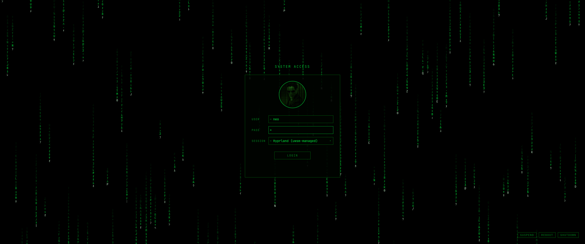
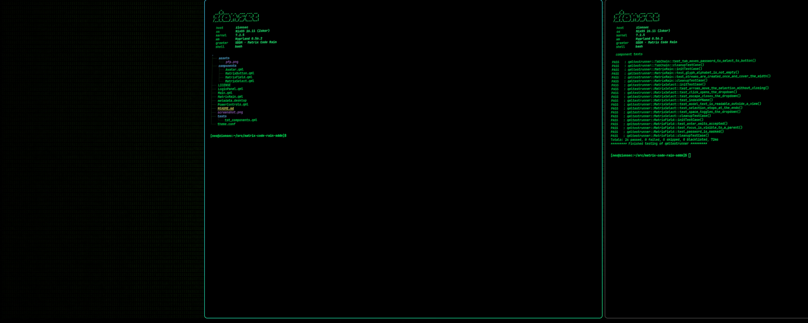
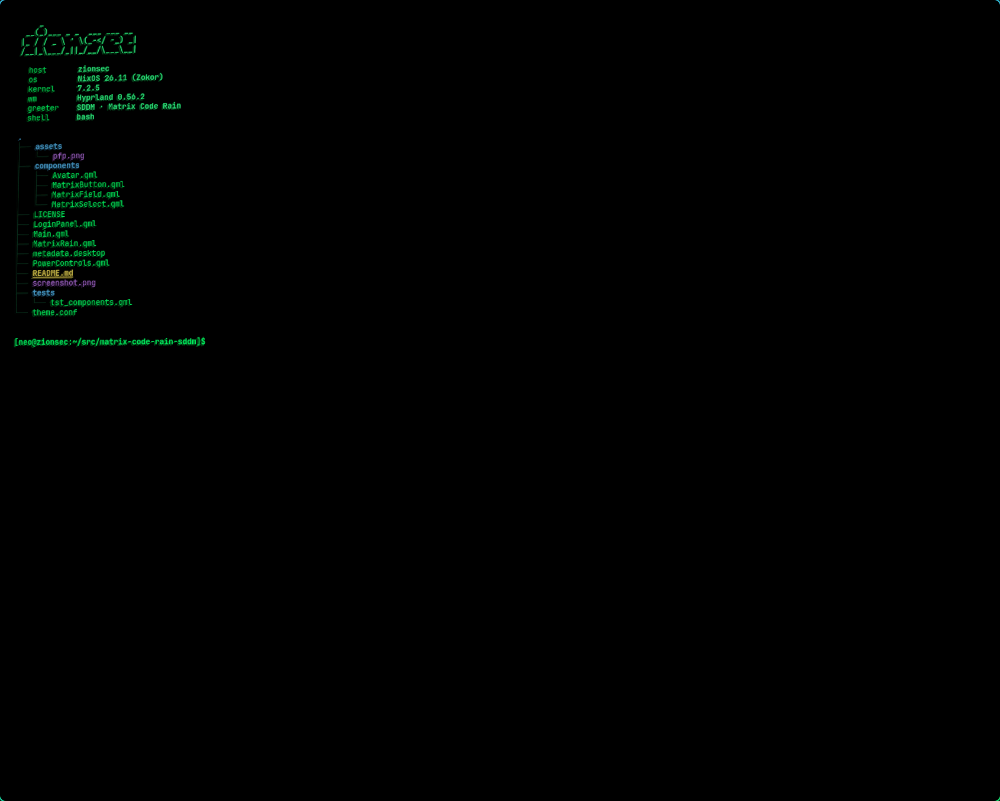
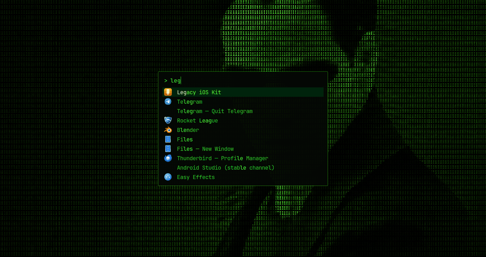

# NixOS workstation dotfiles

An audited configuration extracted from a working Intel / NVIDIA RTX 4090 workstation: Hyprland with native Lua, Ambxst, a horizontal scrolling layout, and a green phosphor CRT Ghostty terminal. This preserves an existing desktop and its practical fixes.

## Stack

- NixOS, pinned nixpkgs, Linux 7.2, systemd-boot, NVIDIA open kernel modules with the stable driver package.
- Hyprland / XWayland, Ambxst shell, SDDM with the [Matrix Code Rain](https://github.com/r3dg0d/matrix-code-rain-sddm) greeter theme, PipeWire, Bibata cursor and JetBrains Mono Nerd Font.
- Bash, Ghostty, Git, tmux, Rust/C/C++/Python/Android tools; Firefox, Thunderbird, Obsidian, MPD/rmpc, Steam, Ollama CUDA and security/OSINT tools.
- NixOS modules manage packages and selected native files. **Home Manager is not used.** Ambxst settings remain writable and are seeded only when absent.

## Layout

```text
flake.nix / flake.lock  pinned inputs and host constructor
hosts/workstation/     system baseline and PUBLIC EXAMPLE hardware
modules/               existing functional NixOS modules
config/                native Lua, Ghostty, fuzzel, Ambxst and theme settings
packages/ / dev/       custom packages and development shell
scripts/               validation and privacy checks
assets/screenshots/    reviewed screenshots used by this README
docs/                  audit, migration, installation and recovery
licenses/              retained third-party notices
```

## Screenshots

### Matrix Code Rain (SDDM)



The login screen: Katakana code rain animated in QML behind a black-and-green
panel, with a profile image, user, password and session controls and compact
power actions. The theme is a separate project,
[matrix-code-rain-sddm](https://github.com/r3dg0d/matrix-code-rain-sddm), which
`modules/login-manager.nix` pins by revision. Captured from
`sddm-greeter-qt6 --test-mode` at 3440×1440.

### Desktop



Hyprland with the Ambxst shell and its horizontal scrolling layout, on the
3440×1440 ultrawide this configuration targets.

### Ghostty



Ghostty with the green phosphor CRT shader from `config/ghostty`, showing the
per-terminal host banner from `modules/shell-greeting.nix`.

### Application launcher



`fuzzel` on `SUPER + SPACE`, themed to match in `config/fuzzel.ini` and wired
up by `modules/app-launcher.nix` — here finding the Legacy iOS Kit entry and
its icon. The same binary, and the same theme, serve the "Open With" picker.

## Start here

Read [INSTALL](docs/INSTALL.md) before activation. The public `workstation` output uses the account `user` and **example disk labels**, not the source machine's identifiers. It is evaluable, but is not a safe disk configuration to apply blindly. Supply generated hardware and your account through a private deployment flake.

```sh
nix flake show
nix flake check
nix fmt
nix develop
```

For a machine intentionally configured to match the public example:

```sh
sudo nixos-rebuild switch --flake .#workstation
```

For an existing TTY session, activating a display manager may interrupt login: its service conflicts with the tty1 getty. Prefer a reviewed `nixos-rebuild boot` followed by a deliberate reboot. The private-deployment instructions are the recommended path for the original workstation.

## Customize and update

Edit native files in `config/`, package groups in `modules/`, and account/hardware settings in your private deployment. Hyprland's Lua bindings are authoritative; Ambxst's keybind UI does not automatically update that file. Writable seeds do not overwrite existing preferences on rebuild.

Inputs are revision-pinned. To upgrade, deliberately change the relevant URL in `flake.nix`, then run `nix flake update`, `nix flake check`, and a build. Merely updating the lock does not advance explicitly pinned revisions. Ambxst retains its own nixpkgs input to preserve its existing dependency graph.

## Recovery, privacy and limitations

Select an older generation in the boot menu, or use `sudo nixos-rebuild switch --rollback` from a working console. See [TROUBLESHOOTING](docs/TROUBLESHOOTING.md).

No account tokens, private keys, machine identifiers, browser profiles, vaults, history, logs or wallpapers are included. Configure secrets outside this repository **and outside Nix source paths**; see [PRIVACY](docs/PRIVACY.md). Original configuration and scripts use MIT; retained template material keeps its own license, described in [NOTICE](NOTICE.md).

Not everything on the source machine is published here. The workstation also
runs modules this repository deliberately omits — among them an Apple device
and virtualization workbench whose launcher entries include **Legacy iOS Kit**
(a terminal launcher, its own icon, and udev access for devices in DFU and
recovery mode), local AI and media services, and emulator packaging. Those
carry their own licensing and privacy review and are kept in the private
deployment.

This reconstructs configuration, not personal data or application accounts. Flatpak applications update independently of Nix; downloaded models, Steam games, Obsidian plugins, credentials and wallpapers need separate setup. Existing Ambxst runtime color errors are documented, not silently fixed.

The screenshots above were reviewed for visible personal information before
publication; `scripts/privacy-scan.py` additionally refuses anything under
`assets/screenshots/` that is not a PNG within a size limit. The desktop shot
deliberately omits the top bar, whose media widget shows whatever is playing.

See [SYSTEM-AUDIT](docs/SYSTEM-AUDIT.md), [MIGRATION](docs/MIGRATION.md), [PACKAGES](docs/PACKAGES.md), and [VALIDATION](docs/VALIDATION.md).
